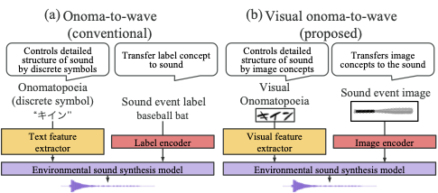
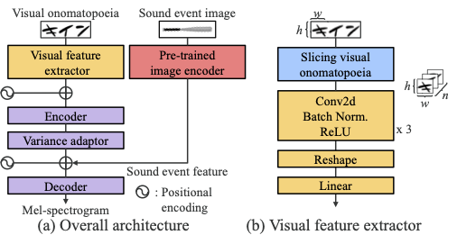
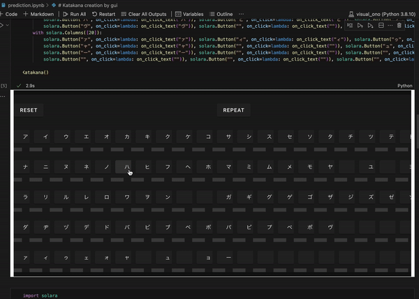

# [ICASSP'23] Visual onoma-to-wave: Environmental sound synthesis from visually represented onomatopoeia
Official implementation of Visual onoma-to-wave: environmental sound synthesis from visual onomatopoeias and sound-source images ([arxiv](https://arxiv.org/abs/2210.09173), [IEEE Xplore](https://ieeexplore.ieee.org/document/10096517)).
Currently, the model of class conditioning by sound source image is not available, and only the model of visual onomatopoeia + sound source image id is available.





## Demo
[[Audio samples]](https://sarulab-speech.github.io/demo_visual-onoma-to-wave/)


## Quick start
First, run the following command to install the dependencies.
```bash
pip install -r requirements.txt
```
Then,run setup.sh.
This will automatically download the pre-trained model.
```bash
bash setup.sh
``` 
Now you can run the script in prediction.ipynb.



## Getting started
### 1. Install dependencies
```bash
pip install -r requirements.txt
```

### 2. Download dataset
1. obtain [the onomatopoeia dataset for RWCP-SSD](https://github.com/KeisukeImoto/RWCPSSD_Onomatopoeia). It includes onomatopoeia words, and alignments.
```bash
cd RWCPSSD_Onomatopoeia
git submodule init
git submodule update
cd ..
```  
2. download [the RWCP-SSD dataset](https://staff.aist.go.jp/m.goto/RWCP-SSD/eng/index.html). It includes environmental sounds. After downloading, please put the dataset in `./corpus/rwcp-ssd/RWCP-SSD_Vol1/*`.

### 3. 3-step preprocessing
<ins>1. formatting the dataset</ins>
- `config/preprocess.yaml`: Configuration file for formatting the dataset. Please edit the file according to your environment.
- `corpus/rwcp-ssd/RWCP-SSD_Vol1`: Path to the RWCP-SSD dataset.
```bash
python scripts/01_format.py config/preprocess.yaml corpus/rwcp-ssd/RWCP-SSD_Vol1
```  
<ins>2. lab file to TextGrid file</ins>
```bash
python scripts/02_prepare_tg.py config/preprocess.yaml
```
After this step, the following folder structure is created.
```
├── visual-onoma-to-wave
│   └── formatted_data/RWCP-SSD
│       ├── audio (wav files)
│       ├── lab
│       ├── text (onomatopoeia words)
│       └── TextGrid
```
<ins>3. Prepare mel-spectrograms, durations, energies, and visual onomatopoeias</ins>  
option::: `--num_workers`: number of workers for multiprocessing. (default: 10)
```bash
python scripts/03_preprocess.py config/ICASSP/preprocess.yaml
```

<ins>4. Train the model</ins>
```bash
python scripts/04_train.py -t config/ICASSP/train.yaml -p config/ICASSP/preprocess.yaml -m config/ICASSP/model.yaml
```

## Citation
```bash
@inproceedings{visual_onoma2wave,
  author={
    Ohnaka, Hien and 
    Takamichi, Shinnosuke and 
    Imoto, Keisuke and 
    Okamoto, Yuki and 
    Fujii, Kazuki and 
    Saruwatari, Hiroshi
  },
  booktitle={ICASSP 2023 - 2023 IEEE International Conference on Acoustics, Speech and Signal Processing (ICASSP)}, 
  title={Visual Onoma-to-Wave: Environmental Sound Synthesis from Visual Onomatopoeias and Sound-Source Images}, 
  year={2023},
  volume={},
  number={},
  pages={1-5},
  doi={10.1109/ICASSP49357.2023.10096517}
}
```

## Code contributors
- [Hien Ohnaka](https://sites.google.com/view/ohnakahien/%E3%83%9B%E3%83%BC%E3%83%A0?authuser=4) (National Institute of Technology, Tokuyama College, Japan.)
- [Shinnosuke Takamichi](https://sites.google.com/site/shinnosuketakamichi/home) (The University of Tokyo, Japan.)

## Reference
- [Onoma-to-wave: Environmental sound synthesis from onomatopoeic words](https://arxiv.org/abs/2102.05872)
- [HiFi-GAN: Generative Adversarial Networks for Efficient and High Fidelity Speech Synthesis](https://arxiv.org/abs/2010.05646)
- [FastSpeech2 implementation](https://github.com/Wataru-Nakata/FastSpeech2-JSUT)
  - Part of our codes follows this implementation.